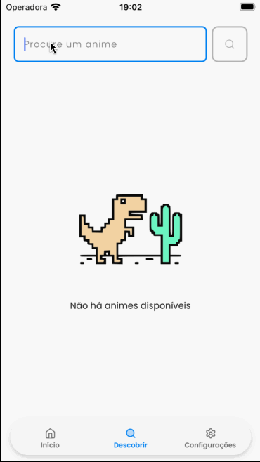
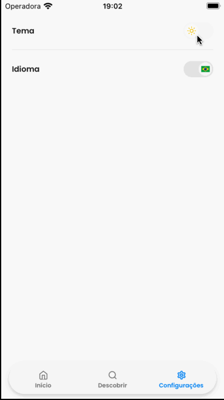
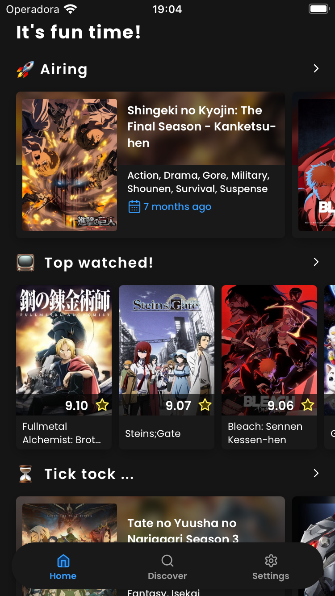
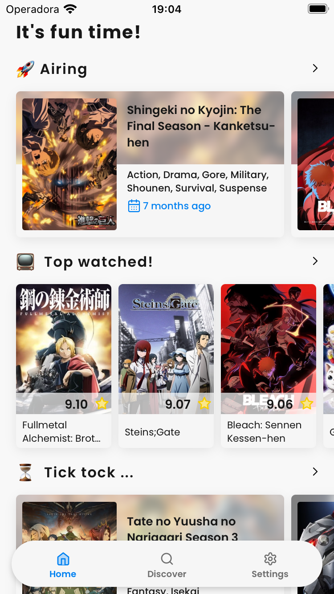

# React Native Animall App

This is a React Native App to show information about Animes and Mangas. The data are fetch from [AnimeList API](https://myanimelist.net/apiconfig/references/api/v2).

* Dark and Light theme
* EN-US and PT-BR language


Project created with Expo CLI. [See official docs](https://docs.expo.dev/get-started/installation/) to set up the environment.

## 🛠 Tecnologias utilizadas

The following tools were used to build the project:

- [Expo](https://expo.io/)
- [React Native](https://reactnative.dev/)
- [TypeScript](https://www.typescriptlang.org/)
- [Tamagui](https://www.tamagui.dev/): Style and UI for React (web and native) meet an optimizing compiler
- [React Navigation](https://reactnavigation.org/docs/getting-started/): Routes and navigation
- [Axios](https://axios-http.com/ptbr/docs/intro): Promise based HTTP client
- [React Query](https://tanstack.com/query/v3/): Fetching, caching, synchronizing and updating server state
- [Legend-state](https://legendapp.com/open-source/state/): Control application states instead of using react native's useState
- [React Native MMKV](https://github.com/mrousavy/react-native-mmkv): The fastest key/value storage for React Native. Using to persist data with Legend-state


## 🚀 Open and run the project

First you need to install the native packages and dependencies.

```
yarn rebuild
```

Run on IOS

```
yarn ios
```

Run on Android

```
yarn android
```

Run on Tests with Jest

```
yarn test
```

Run on Lint to identify problems

```
yarn lint
```

Run on Lint to identify and fix the problems

```
yarn lint:fix
```

## Environment variables

To run this project, you will need to add the following environment variables to your .env

`EXPO_PUBLIC_API_TOKEN`

## Demonstration

### Home


### Ranking


### Search



### Settings




### Dark



### Light
